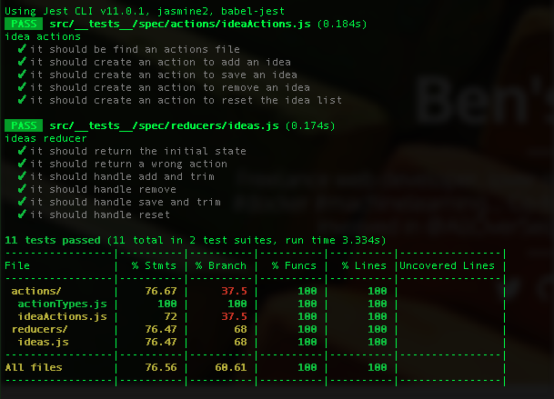

# React Native App with redux based on the 100-10-1 idea

[](https://travis-ci.org/benoitvallon/react-native-redux-app-100-10-1) [](https://david-dm.org/benoitvallon/react-native-redux-app-100-10-1) [](https://david-dm.org/benoitvallon/react-native-redux-app-100-10-1#info=devDependencies)

## Screenshot

### 100-10-1 App


## Libraries/tools

This project uses libraries and tools like:
- es6 syntax
- [react-native](https://facebook.github.io/react-native)
- [redux](https://facebook.github.io/flux) to organize the data flow management
- [redux-storage](https://github.com/michaelcontento/redux-storage) for the data persistence in the App
- [jest](https://facebook.github.io/jest/) and [babel-jest](https://babeljs.io) for the tests

# How to build/run the App

### Requirements for React Native on Mac

- OS X
- Xcode 6.3 or higher is recommended (Xcode only runs on Mac).
- Homebrew is the recommended way to install node, watchman, and flow.
- `brew install node`
- `brew install watchman`. We recommend installing watchman, otherwise you might hit a node file watching bug.
- `brew install flow`. If you want to use flow.

### Running the App

- `npm install` to install all the dependencies, React and React Native among others.
- Open `iosApp.xcodeproj` and hit run in Xcode.
- Hit `cmd+R` in your iOS simulator to reload the App and see your change!

# Run the tests

To run the tests, simply run:

```
npm test
```


